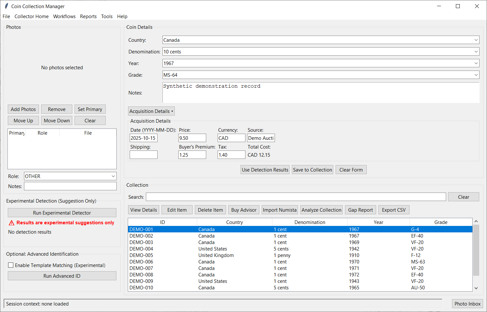
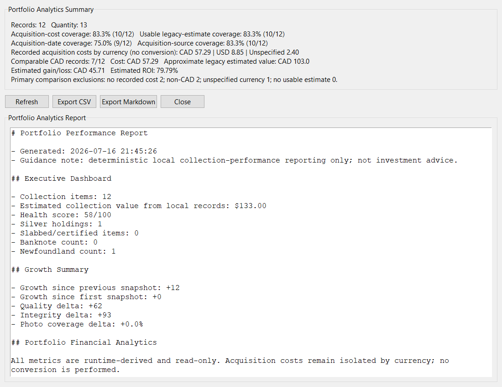
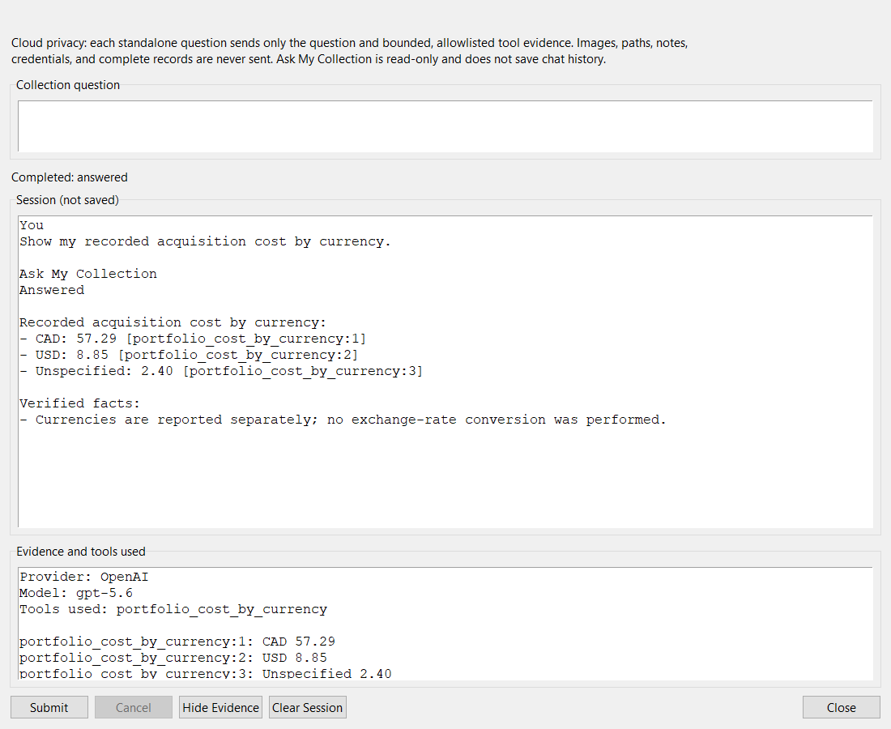
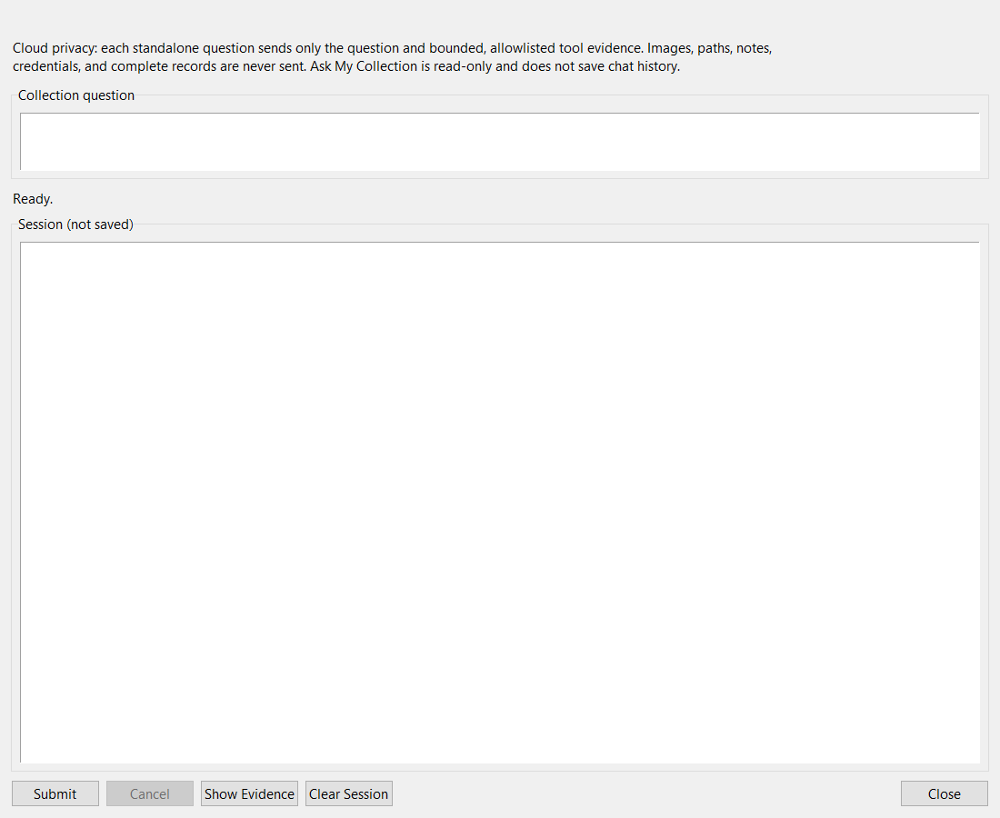
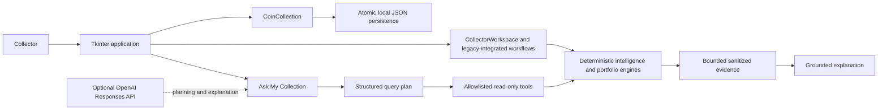

# Coin Analyzer

[](https://github.com/adamo-sys/coin-analyzer/actions/workflows/tests.yml)

Coin Analyzer is a local-first Python desktop application for managing a coin and banknote collection, tracking exact acquisition costs, understanding portfolio coverage, and asking grounded natural-language questions about collection data.

The project combines practical collector workflows with disciplined software engineering: deterministic analytics, backward-compatible JSON persistence, optional cloud AI, explicit privacy boundaries, and 1,598 automated tests.

## See it in action

| Main application | Portfolio Analytics |
| --- | --- |
|  |  |

| Ask My Collection | Short demonstration |
| --- | --- |
|  |  |

*All screenshots and demonstrations use synthetic collection data. No real collection records, API keys, or personal information are shown.*

## Why this project exists

Collectors often spread their records across spreadsheets, photographs, notes, price references, and memory. That makes simple questions surprisingly difficult:

- Do I already own this coin?
- Is a candidate a duplicate or a meaningful upgrade?
- What did I actually spend, including shipping, tax, and buyer's premium?
- How complete is my acquisition history?
- Which holdings can be compared without mixing currencies or inventing valuations?

Coin Analyzer brings those workflows into one Windows desktop application. The core works locally without an account or network connection. When the optional Ask My Collection integration is enabled, natural-language answers remain grounded in deterministic Python tools rather than model-generated calculations.

## Project at a glance

| Metric | Value |
| --- | --- |
| Language | Python |
| Desktop UI | Tkinter |
| Storage | Local JSON |
| AI | Optional OpenAI Responses API |
| Architecture | Local-first with an explicit optional cloud boundary |
| Financial arithmetic | `Decimal` acquisition money |
| Automated tests | 1,598 |
| Primary platform | Windows |

## What it helps you do

### Keep a usable collection record

Add, edit, search, inspect, import, and export coin and banknote records. Items support multiple photographs, collection metadata, grades, quantities, references, comments, and backward-compatible optional fields.

The live collection is stored in `data/collection.json`. It is local runtime data, ignored by Git, and created automatically on the first successful save.

### Track the real cost of acquisitions

Record purchase price, shipping, buyer's premium, tax, acquisition date, source, and currency. Monetary components use `Decimal`, reject invalid or negative values, preserve entered precision, and produce a derived read-only total.

Missing cost remains different from an explicitly recorded zero-dollar acquisition. Currencies remain separate; Coin Analyzer does not silently convert or combine them.

### Understand portfolio coverage

Portfolio Analytics reports:

- Exact recorded costs grouped by currency
- Acquisition cost, date, source, and legacy-estimate coverage
- Source and acquisition-year breakdowns
- A bounded comparable-CAD subset with explicit exclusions
- Approximate estimated gain/loss and ROI only where the stored data is comparable
- Collection growth, series progress, health, risks, and suggested focus areas

Legacy `estimate_cad` values remain approximate. Portfolio reports do not perform exchange-rate conversion, market forecasting, tax analysis, or investment advice.

### Make collection-aware decisions

Deterministic collection engines identify likely duplicates, better-grade upgrade candidates, known date-run gaps, want-list matches, acquisition priorities, and collection-quality opportunities. Supporting workflows include collection dashboards, acquisition review, listing analysis, deal ranking, photo-assisted entry, Photo Inbox, Image Assessment, Canadian reference providers, Connected Data, and confirmed observations.

OCR and image-recognition utilities are experimental or advisory. Pixel-derived output never becomes an authoritative collection fact without review.

### Ask grounded natural-language questions

Ask My Collection supports standalone questions such as:

> How many Canadian one-cent records are in my collection?

> Which 1967 holdings are duplicates?

> Show my recorded acquisition cost by currency.

> What percentage of my records have acquisition costs?

> Show the comparable-CAD portfolio summary.

The language model interprets the question and explains evidence. It does **not** calculate collection totals or modify collection records. Deterministic Python engines remain the source of truth, and verified tool summaries remain visible alongside evidence identifiers and limitations.

If a model explanation introduces unsupported numeric wording or fails validation, Coin Analyzer falls back to deterministic tool text.

## Engineering highlights

- **Local-first architecture:** collection management, persistence, analytics, and intelligence work without cloud services.
- **Grounded AI:** the model plans and explains; allowlisted deterministic tools calculate.
- **Exact money:** acquisition components use `Decimal`, not binary floating point.
- **Derived totals:** `total_cost` cannot become stale because it is calculated from its components.
- **Backward compatibility:** older JSON and CSV records load without migrations or fabricated acquisition data.
- **Atomic persistence:** collection writes use a validated temporary-file replacement workflow.
- **Optional dependency isolation:** core startup and CI do not require the OpenAI SDK or an API key.
- **Regression discipline:** 1,598 automated tests cover backend, persistence, workflows, integrations, and headless GUI behavior.
- **Decision records:** accepted architectural choices are documented as ADRs.

## How grounded AI works



The current GUI is intentionally described as it exists: it directly owns several collection workflows while selected panels use `CollectorWorkspace` as a unified service layer. The architecture documentation distinguishes implemented coupling from future dependency guardrails.

## Privacy model

Core use is local. Ask My Collection introduces an optional, explicit cloud boundary.

Planning requests send only:

- The standalone question
- System instructions
- Schemas for eleven allowlisted read-only tools

Explanation requests send only:

- The standalone question
- System instructions
- Bounded sanitized tool results
- Evidence identifiers, limitations, and truncation status

The adapter does not send complete collection records, notes, comments, images, absolute paths, credentials, local state files, or conversation history. Requests use `store=False`, and each question is treated as standalone.

A controlled live-provider acceptance test using 10 synthetic records and `gpt-5.6` completed six representative questions with exact agreement between model wording and deterministic results. The sample used 12 successful provider calls, averaged approximately 5.4 seconds end to end per question, and cost approximately US$0.083 at the published rates available during the test. These figures are acceptance observations, not performance guarantees.

## Quick start

### Requirements

- Windows
- Python 3.12 or newer recommended
- Tkinter, normally included with the Windows Python installer

CI currently verifies Python 3.12. The optional live-provider acceptance test also ran successfully on Python 3.14.

### Install and run

```powershell
git clone https://github.com/adamo-sys/coin-analyzer.git
cd coin-analyzer

# Preferred when the Windows Python launcher is available:
py -3.12 -m venv .venv

# Fallback when `py` is unavailable:
python -m venv .venv

.\.venv\Scripts\python.exe -m pip install --upgrade pip
.\.venv\Scripts\python.exe -m pip install -r requirements.txt
.\.venv\Scripts\python.exe coin_collection_gui.py
```

Use one virtual-environment command, not both. Whichever `py` or `python`
executable you select must report Python 3.12 or newer.

After dependencies are installed, `Launch_Coin_Analyzer.bat` is also available as a Windows launcher.

A fresh installation begins with an empty collection. Back up `data/collection.json` independently; cloning or backing up the repository does not preserve live collection data. See [Backup and recovery](docs/BACKUP.md).

## Optional Ask My Collection setup

Core collection management does not require an API key or AI dependency.

```powershell
.\.venv\Scripts\python.exe -m pip install -r requirements-ai.txt
$env:OPENAI_API_KEY = "<your-api-key>"
$env:COIN_ANALYZER_OPENAI_MODEL = "gpt-5.6"
.\.venv\Scripts\python.exe coin_collection_gui.py
```

Set the credential only in the launching environment. Do not place it in source files, screenshots, fixtures, or documentation. Provider availability, pricing, and model support are external dependencies and may change.

## Testing

Run the complete `unittest` suite from the repository root:

```powershell
.\.venv\Scripts\python.exe -m unittest discover -s . -p "test_*.py"
```

The current verified baseline is **1,598 passing tests**. Normal tests use isolated fixtures, temporary directories, and fake AI adapters; they do not load the live collection or make provider calls.

See [TESTING.md](TESTING.md) for fixture, OCR experiment, GUI, and manual-acceptance guidance.

## Current boundaries

- Windows is the primary supported desktop platform.
- `coin_collection_gui.py` is the supported GUI entry point; `main.py` and `gui.py` are legacy or experimental surfaces.
- The integrated Tkinter GUI still owns several workflows directly; the service layer is not yet its exclusive dependency.
- Collection storage is single-user local JSON, not a concurrent database.
- Users are responsible for independent backups of live collection data and photographs.
- Acquisition currencies are reported separately; no exchange-rate conversion is performed.
- Legacy estimates are approximate and are not live market valuations.
- Ask My Collection is read-only, session-only, and provider-dependent. UI cancellation ignores a late response but does not terminate an in-flight HTTP request.
- OCR, recognition, grading, and template experiments require collector review and may have optional local dependencies.

## Repository tour

| Path | Purpose |
| --- | --- |
| [`coin_collection_gui.py`](coin_collection_gui.py) | Supported Tkinter application entry point and integrated presentation/controller layer |
| [`coin_collection.py`](coin_collection.py) | Collection model, acquisition validation, import/export, and JSON persistence |
| [`collector_workspace.py`](collector_workspace.py) | Unified service layer used by selected panels and workflows |
| [`grounded_collection_assistant.py`](grounded_collection_assistant.py) | Provider-neutral grounding, tool allowlist, evidence, and validation |
| [`portfolio_performance.py`](portfolio_performance.py) | Deterministic portfolio and financial analytics |
| [`ARCHITECTURE.md`](ARCHITECTURE.md) | Current architecture, data flows, subsystem boundaries, and extension points |
| [`USER_GUIDE.md`](USER_GUIDE.md) | Detailed collector workflows and application guidance |
| [`TESTING.md`](TESTING.md) | Test strategy, fixtures, commands, and manual checks |
| [`docs/adr/`](docs/adr/) | Accepted architecture decision records |
| [`docs/ENGINEERING_PLAYBOOK.md`](docs/ENGINEERING_PLAYBOOK.md) | Contribution workflow, review gates, testing, and release practices |
| [`ROADMAP.md`](ROADMAP.md) | Durable product direction and future candidates |
| [`RELEASE_HISTORY.md`](RELEASE_HISTORY.md) | Historical internal development milestones |

## Key architectural decisions

- [ADR-001: Local-first architecture](docs/adr/ADR-001-local-first.md)
- [ADR-002: JSON over SQLite](docs/adr/ADR-002-json-over-sqlite.md)
- [ADR-003: Decimal representation for money](docs/adr/ADR-003-decimal-money.md)
- [ADR-004: Derived acquisition totals](docs/adr/ADR-004-derived-acquisition-totals.md)
- [ADR-005: Portfolio financial comparability](docs/adr/ADR-005-portfolio-financial-comparability.md)
- [ADR-006: Grounded collection assistant](docs/adr/ADR-006-grounded-collection-assistant.md)

## Project direction

The internal `v8.x` and `v9.x` labels document historical development phases. Public semantic-version release preparation is tracked separately and will not rewrite that history.

See the [roadmap](ROADMAP.md) for current direction. Feature candidates require repository inspection, explicit acceptance criteria, and an approval gate before implementation.

## Contributing

Start with the [Engineering Playbook](docs/ENGINEERING_PLAYBOOK.md) and use the repository's engineering-change issue template. Changes are expected to preserve backward compatibility, include proportionate regression coverage, and remain small enough to review as one coherent decision.

## License

Licensed under the [Apache License 2.0](LICENSE).
